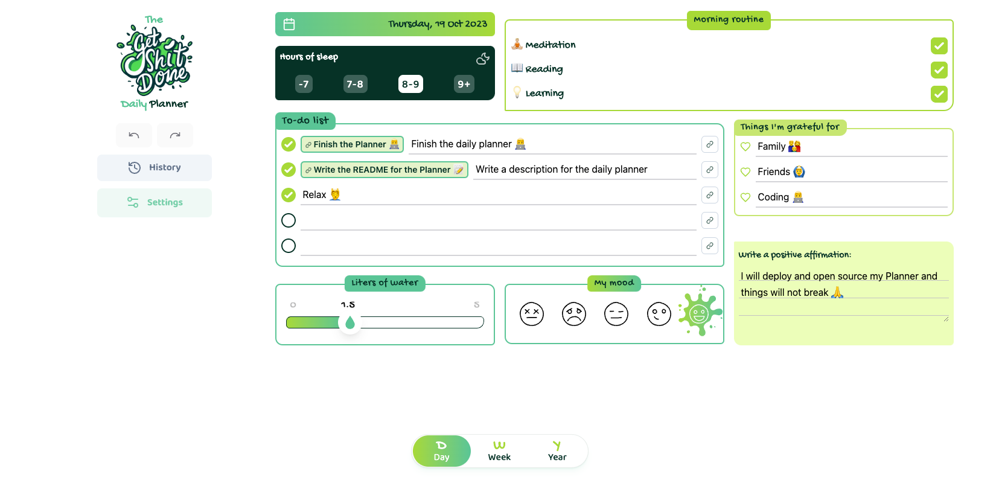
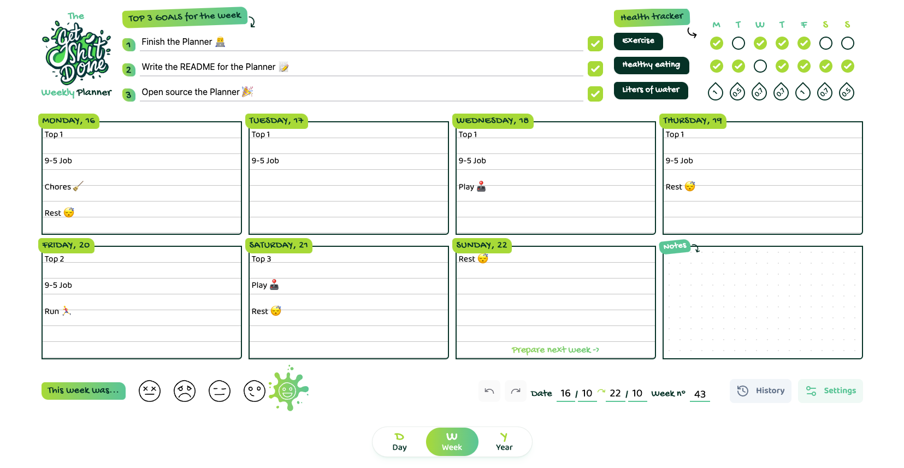
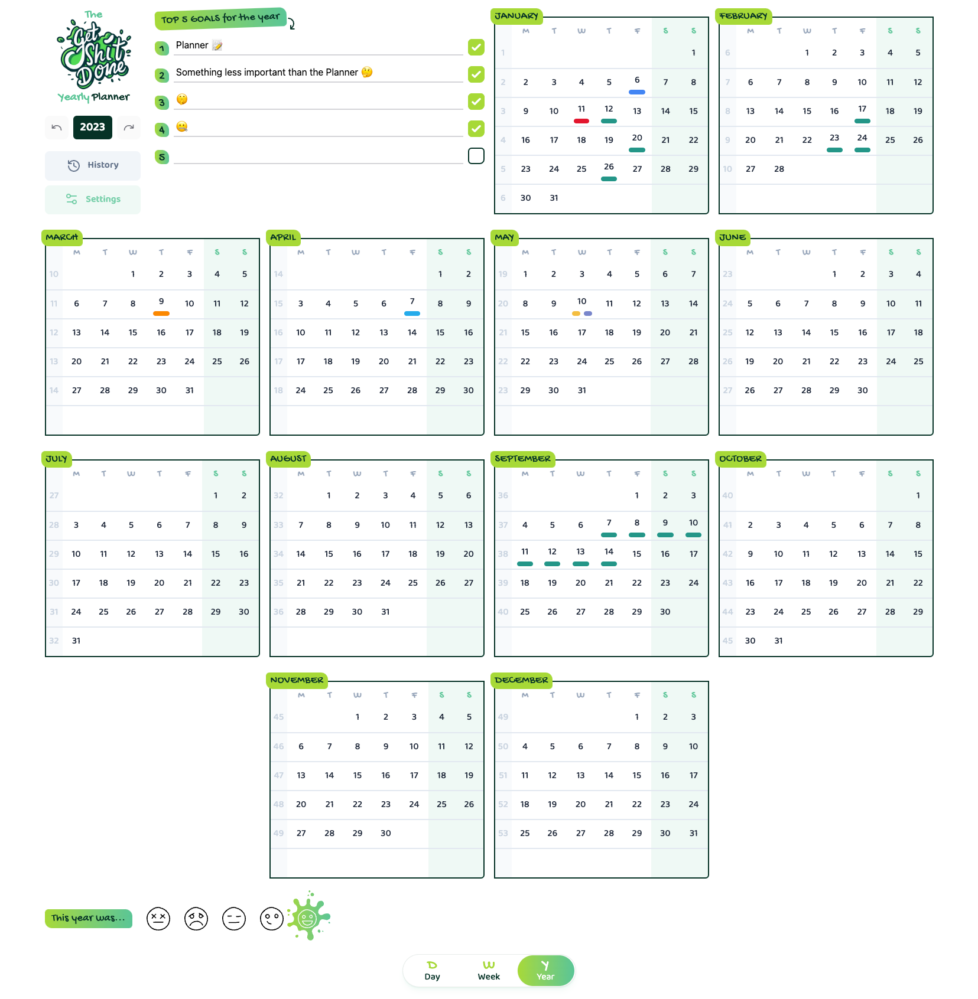

# Planner

[](https://planner-ricardopbarbosa.vercel.app)
[](http://makeapullrequest.com)
[](http://www.firsttimersonly.com/)

# Introduction

#### ℹ️ This is my 2nd iteration on the app. It started as a [Weekly Planner](https://github.com/RicardoPBarbosa/weekly-planner) only.

#### This is my personal planner that I use since 2019. I started by doing the design (heavily inspired by [this weekly planner](https://inkyinthewild.com/products/a4-weekly-planner-desk-pad-to-do-list-motivation-goal-setting-notepad-student-revision-agenda-office-notebook-organiser-with-health-tracker)) in Figma and printed it.

#### But now, after more than 100 pages printed, I see that it's not a scalable option, so I decided to make the web version of it. 🤷‍♂️

#### And decided to share it, in case it fits the needs of some other being out there in the vastness of space. 🔭

# Daily Planner

* Basic features: Hours of sleep, morning routine, to-do list, things to be grateful for, affirmation, liters of water drank, and the mood for the day.
* You can link a to-do to a weekly goal set on the Weekly Planner page to keep track of the progress towards that week.
* You have access to a review dashboard for every month you have daily entries (inside the History page)

# Weekly Planner

* Basic features: Top 3 weekly goals, health tracker, free text for daily tasks, and the mood at the end of the week.
* You have access to a review dashboard for every year you have weekly entries (inside the History page)

# Yearly Planner

* Basic features: Top 5 yearly goals, calendar view with events by category color, month view by clicking on the month name, and the mood for that year.
* You have access to a review dashboard for every year you have yearly entries (inside the History page)
* Also inside the History page you have access to a Retrospective page where you can review the year by category or in general (free text), and also a set of questions to answer to help you reflect on the year.

## Other features

## History 🕒
Here you can see and edit the previous days/weeks/years. You can also create an entry in the past.

## Sync data to a cloud database ☁️
Link your google account, and sync the data to [Firebase](https://firebase.google.com/).

## PWA features
This is a PWA (Progressive Web App), which means that you can install it as an app, and use it offline. 

## Offline Capabilities
You can use it offline, and it will sync the new data when you're back online. As offline data goes you will have available the last synced data when you were online. All this is handled by [Firebase](https://firebase.google.com/docs/firestore/manage-data/enable-offline).

# Run it locally

```sh
  # Clone this repository
  $ git clone https://github.com/RicardoPBarbosa/planner.git

  # Go into the repository
  $ cd planner

  # Install dependencies
  $ pnpm i

  # Setup the environment variables
  $ cp .env.example .env # and fill it with your own firebase info

  # Run the app
  $ pnpm dev
```

# Support

<a href="https://www.buymeacoffee.com/ricardopbarbosa"></a>

# License
MIT
